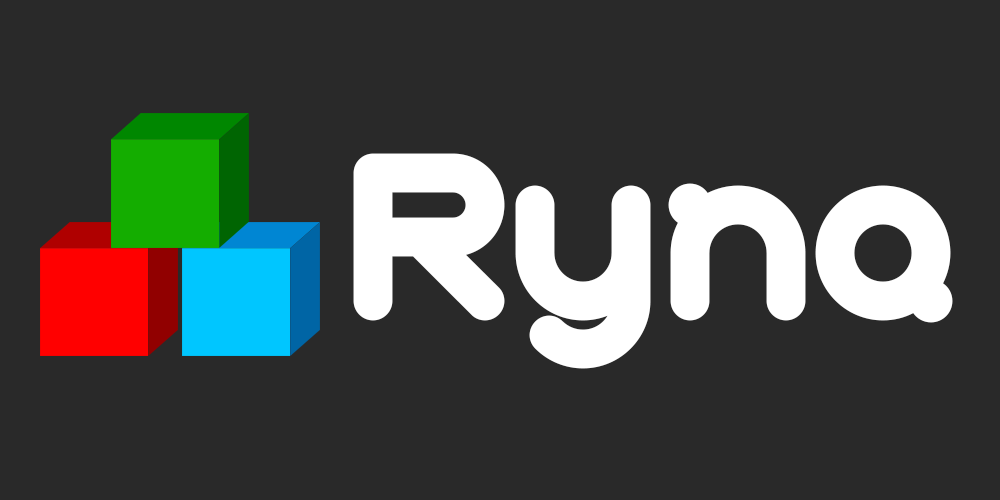

[](https://github.com/Gabie-of-the-Bo/Nessa-Language/actions/workflows/rust.yml) [](https://codecov.io/gh/Gabie-of-the-Bo/Nessa-Language)

<p align="center">
  
</p>
  
# What is _Nessa_?

**_Nessa_** is an imperative concept programming language with formal enough semanticas to allow mathematical proofs. Many of its ideas come from the [_ULAN Language_](https://idus.us.es/handle/11441/84976) <sup>(Spanish only)</sup>, of which I'm also the author. The points of this language are to challenge the idea of classical sotware mantainability and to take extensible programming to an extreme in order to minimize syntatical and semantical noise.

# Is _Nessa_ ready for production use?

**Not yet**. There is not even an stable release of the complete language, so don't expect it to work just yet. It is expected that this language will have a minimal **experimental** release soon, and features will be added as issues are created or as they seem to make sense.

# Features

> _**Disclaimer:** This entire list is but a sketch for now, so don't take anything too seriously until there is a working release. Note that this is a tremendous amount of work and cannot be done in too little time. Features may be added or discarded as the project goes on, so be patient :)_

This is a _WIP_ list of features that Nessa will have when it is released:
* Arbitrary precision integer arithmetic.
* Full parametric algebraic types:

  ```typescript
  a: Int | String;        // Either a number or a string
  b: (Int, String);       // A number followed by a string
  c: Array<Int | String>; // An array of elements that are either numbers of strings
  ```

* **Powerful function overloading semantics**: you will be able to define functions using this rich type system and make use of call polymorphism semantics:

  ```typescript
  fn this_is_a_test(a: Int) -> Bool {
    return true;
  }

  fn this_is_a_test(a: String) -> Bool {
    return false;
  }

  // Both valid
  this_is_a_test(5);      // Returns true
  this_is_a_test("Test"); // Returns false
  ```

* **Generic template-based programming**: parametric types are also supported by means of templating in a similar way as _C++_ does:

  ```typescript
  fn<T> is_number(a: T) -> Bool {
    return a.is<Int>();
  }

  // Template arguments are automatically inferred from the parameters if possible
  5.is_number();        // This is true
  "Test".is_number();   // This is false
  5.is_number<Int>() // You can also explicitly instantiate the template
  ```

* **Custom literals**: you will be able to create new literals using an internal language called _NDL_ (_Nessa Definition Language_):

  ```typescript
  class Dice {
    // Syntax definition
    syntax from Arg(1{d}, rolls) 'D' Arg(1{d}, faces)

    faces: Int
    rolls: Int
  }

  //Usage
  dice = 4D20 // Four dice of twenty sides
  ```

* **Compile-time syntax extensions**: you will be able to extend the syntax of the language using _NDL_ by means of high level patterns:

  ```typescript
  syntax array_initialization from '<' Arg(<type>, type) '>[' [{Arg(<expr>, elems) ',' {' '}} Arg(<expr>, elems)] ']' {
      {#let res = arr<} {$type} {#>(} {#);\n}
      {@i in $elems} {
          {#res.push(} {$i} {#);\n}
      }
      {#return *res;}
  }

  let array = <Int>[1, 2, 3, 4];
  ```

* **Operator and operation definitions**: the language allows the definition of new operators and operations using an easy syntax:

  ```typescript
  // Operator definition
  unary postfix op "++" (500);
  binary op "<=>" (1000);
  nary op from "`" to "´" (1500);
  
  // Operation definition for each operator
  // These can be overloaded and templated just the same as functions
  op (a: &Int) ++ {
    return a + 1;
  }
  
  op (a: &Int) <=> (b: &Int) {
    if a < b {
      return -1;
    }
    
    if a > b {
      return 1;
    }
    
    return 0;
  }
  
  op (a: &Int) `(b: &Int, c: &Int)´ {
    return a + b * c; // This one is pretty much made up
  }
  ```
